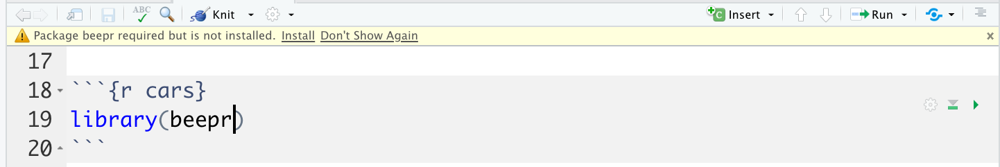

layout: true
  
<div class="my-header"></div>

<div class="my-footer"> 
 CC BY-NC-ND 4.0 <a href="https://mdogucu.ics.uci.edu">Mine Dogucu</a></div> 

---

```{r setup, include=FALSE}
knitr::opts_chunk$set(echo = FALSE)
```

class: center, middle

## License

```{r echo=FALSE, out.width='80%', warning=FALSE}

library(emojifont)
library(ggplot2)

```


More information can be found [here](https://creativecommons.org/licenses/by-sa/2.5/).

---

class: middle

## About Me

- Assistant Professor of Teaching, Department of Statistics.
- I started at UCI in July 2019.
- Fun fact: I used to live in Asia while working in Europe.

---

class: middle center

## Intro Data Science at UCI

```{r echo=FALSE, fig.align='center', out.width="25%"}

```

Exploratory Data Analysis, Data Wrangling, Statistical Inference and Modeling

[Full Schedule and Slides](https://www.introdata.science/schedule.html)

---

class: middle center


```{r echo=FALSE, fig.align='center', out.width="25%"}
knitr::include_graphics("img/nsf-logo.png")
```

This workshop is supported by NSF HDR DSC awards #2123366 #2123380 and #2123384

University California Irvine, California State University Fullerton, and Cypress College collaboration

---

class: middle

## About you?

- I assume intro statistics knowledge.
- No prior R knowledge required.
- What do you teach?
- What tools do you use (e.g. R, calculator, etc.) for teaching?
- What would you like to achieve today?
- Fun facts?

---

class: middle

.pull-left[

I need help.   
Can someone help me please?

```{r echo=FALSE, out.width='80%'}
knitr::include_graphics('img/red-postit.jpg')
```

]


.pull-right[
I am done.   
I cannot wait to help others.

```{r echo=FALSE, out.width='80%'}

```
]

---

class:  middle

## Materials

[bit.ly/dogucu-workshops](http://bit.ly/dogucu-workshops) - Click on the `r fontawesome::fa("laptop")`Slides 

Keep the slides open throughout the workshop. 
 
Click on the [GitHub icon `r fontawesome::fa("github")`](https://github.com/mdogucu/teach-tidyverse).


Click the green Code button on the upper-right(ish) and then Download ZIP to download today's materials.


---

## Installations 

- Download R (unless you have the latest version)
- Download RStudio (unless you have the latest version)
- Open today's materials by clicking the `teach-tidyverse.Rproj`. 
- We always open `.Rproj` file first now and in the future. More on this later.
- In the Files pane find `starter-codes` folder and open `0-setup.R` file. 
-RStudio will ask you to do some installations. Click on `Install` in the yellow banner.

```{r echo = FALSE, out.width="80%", fig.align='center'}

```

---

These are opinionated set of settings that I recommend to my students. In the upper menu of RStudio click on Tools>Global Options

```{r echo=FALSE, out.width='38%', fig.align='center'}

```
Under Code tab on the left they can also choose colors. Students love colors! Most importantly you need to increase your font size so that they can see your screen better.

---


class: middle

## Please do

- Ask questions 
- Ask for help
- Help each other

---

class: middle

## Please do not

- Copy-paste my code from slides (running into problems while typing is part of the learning).
- Judge anyone or question.

---

class: middle

## Why R?

- Community (definitely the number 1 reason). 
- It is free.
- It is open source (more on this later).
- Not only the language but also the culture around it mostly favoring open access. Thus it is easier to find open access teaching materials.

---

class: middle

## What is tidyverse?

I will explain this later. 

---

class: middle

##  Data Science Cycle

```{r echo=FALSE, out.width='100%'}
knitr::include_graphics('img/data-cycle.png')
```

.footnote[Image from Grolemund, G., & Wickham, H. (2018). R for data science (CC BY-NC-ND 3.0).]

---

class: middle

## Note on My Teaching Style

- I do not teach in a linear fashion.
- This is intentional. 
- More on this later.

---

class: middle


## Schedule for the Day

__10:00 - 10:15 Introduction and Setup__  
10:15 - 11:15 Introduction to Toolkit and Data Basics  
11:20 - 12:30 Data Visualization  
1:00 - 1:45 Data Wrangling   
1:45 - 2:15 Packages and External Datasets  
2:15 - 2:30 Wrap Up  


