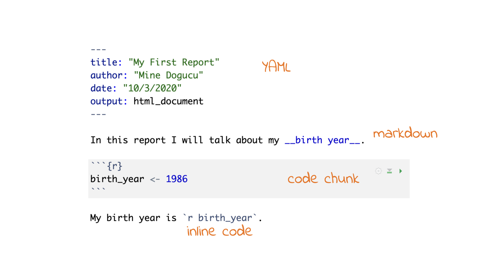
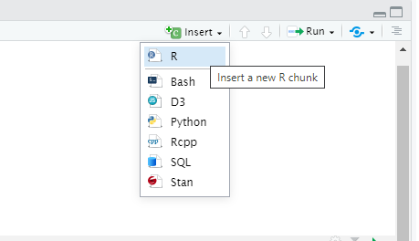
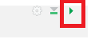
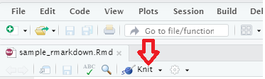
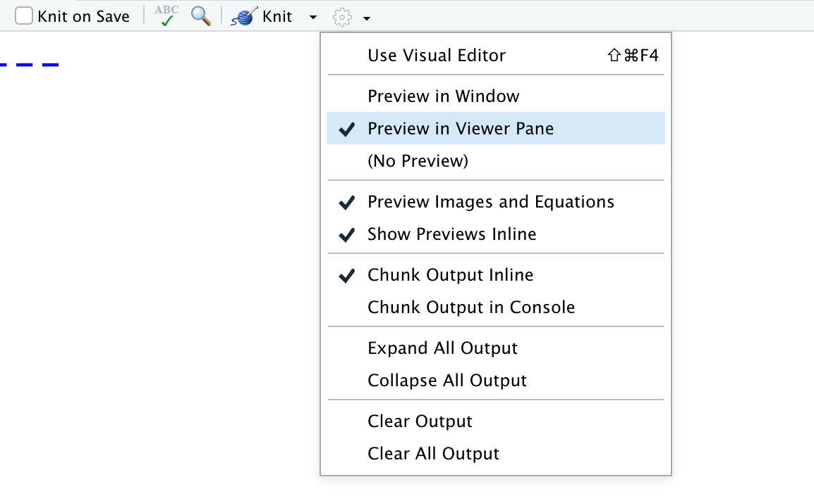
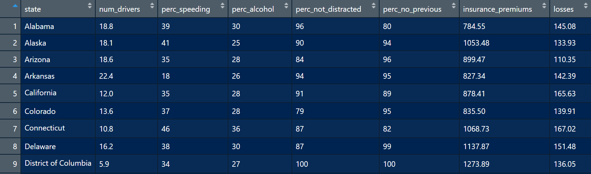
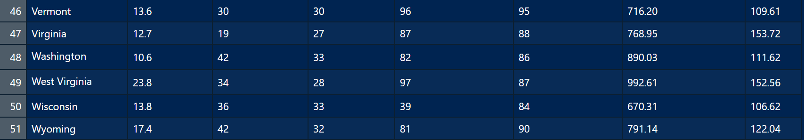
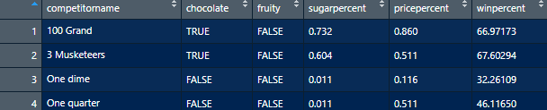
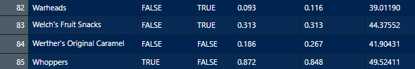
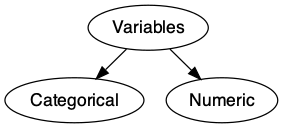

layout: true

<!-- This file by Mine Dogucu is licensed under a  Attribution-ShareAlike 2.5 Generic License (CC BY-SA 2.5) More information about the license can be found at https://creativecommons.org/licenses/by-sa/2.5/ -->
  
<div class="my-header"></div>

<div class="my-footer"> 
 CC BY-NC-ND 4.0 <a href="https://mdogucu.ics.uci.edu">Mine Dogucu</a></div> 

---

class: middle

- R & RStudio
- R Markdown 
- Getting to know data
- Getting to know variables

---

```{r echo=FALSE}
options(scipen = 999)
```

class: inverse center middle

.font75[Introduction to R & RStudio]

---

class: middle center

<video width="80%" height="45%%" align = "center" controls>
  <source src="screencast/01a-hello-world.mp4" type="video/mp4">
</video>


---

class: inverse middle center

.font100[R review]

---

class: middle 

## Object assignment operator

```{r}
birth_year <- 1950
```


--

|                            | Windows        | Mac              |
|----------------------------|----------------|------------------|
| Shortcut     | Alt + -        | Option + -       |


---

class: middle

## R is case-sensitive


```{r error=TRUE}

my_age <- 2020 - birth_year

My_age
```

--


---


class: middle

If something comes in quotes, it is not defined in R. 


```{r}

ages <- c(25, my_age, 32)

names <- c("Menglin", "Mine", "Rafael")

data.frame(age = ages, name = names)
```

---


## Vocabulary

```{r eval=FALSE}
do(something)
```

`do()` is a function;   
`something` is the argument of the function.
--

```{r eval=FALSE}
do(something, colorful)
```

`do()` is a function;   
`something` is the first argument of the function;   
`colorful` is the second argument of the function.

---

class: middle

## Getting Help

In order to get any help we can use `?` followed by function (or object) name. 

```{r eval=FALSE}
?c
```


---

## tidyverse_style_guide

canyoureadthissentence?


--
    
.pull-right[

```{r eval = FALSE}
age <- c(6, 9, 15)

data.frame(age_kid = age)
```

[Tidyverse style guide link](https://style.tidyverse.org/)
]

--

.pull-left[

After function names do not leave any spaces.

Before and after operators (e.g. <-, =) leave spaces. 

Put a space after a comma, **not** before. 

Object names are all lower case, with words separated by an underscore.

]


---

class: middle center


#### RStudio Setup

<video width="80%" height="45%%" align = "center" controls>
  <source src="screencast/01b-rstudio-setup.mp4" type="video/mp4">
</video>

---


class: inverse middle center

.font150[R Markdown]

---

class: inverse middle center

.font150[~~R~~ Markdown]

---


## markdown `r fontawesome::fa(name = "markdown", fill = "#4d2600")`

<br>


.pull-left[

```
_Hello world_ 

__Hello world__

~~Hello world~~ 
```
]

.pull-right[

_Hello world_ 

__Hello world__

~~Hello world~~ 
]
---

class: inverse middle

.font100[`r fontawesome::fa(name = "r-project")` = .R file]

.font100[`r fontawesome::fa(name = "markdown")` = .md file]

.font100[`r fontawesome::fa(name = "r-project")` + `r fontawesome::fa(name = "markdown", fill = "white")` = .Rmd file]

---

class: center middle

#### R Markdown


<video width="80%" height="45%%" align = "center" controls>
  <source src="screencast/01c-intro-rmarkdown.mp4" type="video/mp4">
</video>

---

```{r echo=FALSE, out.width='100%'}

```

---
class: center middle

## Add Chunk

```{r echo=FALSE, out.width='50%'}

```

---

class: center middle

## Run the Current Chunk

```{r echo=FALSE, out.width='20%'}

```

**Always** remember to run codes that I have provided for you before going over lecture notes and/or doing assignments.

---

class: center middle 

## Knit

```{r echo=FALSE, out.width='50%'}

```

---

class: center middle 

## Knit

```{r echo=FALSE, out.width='50%'}

```

Having output documents open in viewer pane helps when teaching.

---

class: middle center


## Shortcuts

|                            | Windows          | Mac              |
|----------------------------|------------------|------------------|
| add chunk                  | Ctrl + Alt + I   | Cmd + Option + I |
| run the current chunk      | Ctrl + Alt + C   | Cmd + Option + C |
| run current line/selection | Ctrl + Enter     | Cmd + Return     |
| knit                       | Ctrl + Shift + K | Cmd + Shift + K  |


---

class: middle

## Slides for this workshop

Slides that you are currently looking at are also written in R Markdown. 
We will take a look at them at the end of the workshop.
If you prepare your teaching slides with R Markdown then you will 1) get more practice with R Markdown 2) get to be a role model for your students. 

---


class: middle


## Data Frames 


```{r echo = FALSE, message=FALSE, warning=FALSE}
library(magrittr)
library(dplyr)
library(fivethirtyeight)
library(openintro)
library(tidyverse)
library(DiagrammeR)
library(DiagrammeRsvg)
library(rsvg)
library(janitor)

data(bad_drivers)
candy_rankings <- candy_rankings %>% 
  select(competitorname, chocolate, fruity, sugarpercent, pricepercent, winpercent)
```

Context: [Dear Mona, Which State Has the Worst Drivers?](https://fivethirtyeight.com/features/which-state-has-the-worst-drivers/)

---

class: middle

## Data Frame `bad_driver`  

```{r echo=FALSE, out.width='100%'}


```

---

class: middle

## Data Frame `bad_driver`  

- The data frame has 8 __variables__ (`state`, `num_drivers`, `perc_speeding`, `perc_not_distracted`, `perc_no_previous`, `insurance_premiums`, `losses`). 

- The data frame has 51 __cases__. Each case represents a US state (or District of Columbia). 

---

class: inverse center middle

.font100[functions for data frames]

---

class: middle

```{r}
head(bad_drivers)
```

---

class: middle

```{r}
tail(bad_drivers)
```

---

class: middle

```{r}
glimpse(bad_drivers)
```

---

class: middle

```{r}
ncol(bad_drivers)
```

---

class: middle

```{r}
nrow(bad_drivers)
```


---

class: center  middle

## Getting to Know the Data Frame in Action

<video width="80%" height="45%%" align = "center" controls>
  <source src="screencast/01i-data-interface.mp4" type="video/mp4">
</video>


---

class: middle

Using the starter code for this section of the workshop, can you write a sentence noting down the number of variables and number of observations in the `bad_driver` data frame?

---

class: middle 

## Data Frame for You to Try Out `candy_rankings`

```{r echo=FALSE, out.width='100%'}


```

---

class: center middle

## Bob Ross

<iframe width="560" height="315" src="https://www.youtube.com/embed/zIbR5TAz2xQ" frameborder="0" allow="accelerometer; autoplay; encrypted-media; gyroscope; picture-in-picture" allowfullscreen></iframe>


---

class: middle

```{r}
glimpse(bob_ross)
```

---

class: middle

class: center middle 


##`candy_rankings` vs `bob_ross`

False - 0  
True - 1

---

class: middle


## Variables

```{r echo=FALSE, out.width='100%'}


```

---

class: middle

```{r echo = FALSE, fig.align='center'}
diagram_small <- grViz("
    digraph {
        # graph aesthetics
        graph [ranksep = 0.3]
        # node definitions with substituted label text
        1 [label = 'Variables']
        2 [label = 'Categorical']
        3 [label = 'Numeric']
        
        # edge definitions with the node IDs
        1 -> 2
        1 -> 3
    }
")
tmp <- capture.output(rsvg_png(charToRaw(export_svg(diagram_small)),'img/diagram_small.png'))
 
```

---

class: middle

## Variables

Variables `n_kids` (number of kids), `height`, and `winpercent` are __numerical variables__. 

--

We can do certain analyses using these variables such as finding an average `winpercent` or the maximum or minimum `winpercent`.

--

Not everything represented by numbers represents a numeric quantity. e.g. Student ID, cell phone number.

---

class: middle

## Variables

Variables such as `chocolate`, `fruity`, and `class_year` (first-year, sophomore, junior, senior) are __categorical variables__. 

--

Categorical variables have __levels__. For instance `chocolate` and `fruity` both have two levels as `TRUE` and `FALSE` and `class_year` have four levels.

---

class: middle

```{r}
glimpse(candy_rankings)
```

---

class: middle

```{r}
glimpse(mariokart)
```

---


class: middle

`character`: takes string values (e.g. a person's name, address)  
--

`integer`: integer (single precision)  
--

`double`: floating decimal (double precision)   
--

`numeric`: integer or double  
--

`factor`: categorical variables with different levels  
--

`logical`: TRUE (1), FALSE (0)  

---

class: inverse middle

As a data scientist it is .font30[**your**] job to check the type(s) of data that you are working with. Do .font30[**not**]  assume you will work with clean data frames, with clean names, labels, and types.


---


class: middle


## Schedule for the Day

__10:00 - 10:15 Introduction and Setup__  
__10:15 - 11:15 Introduction to Toolkit and Data Basics__  
11:20 - 12:30 Data Visualization  
1:00 - 1:45 Data Wrangling   
1:45 - 2:15 Packages and External Datasets  
2:15 - 2:30 Wrap Up 