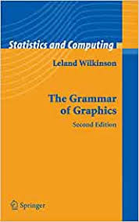
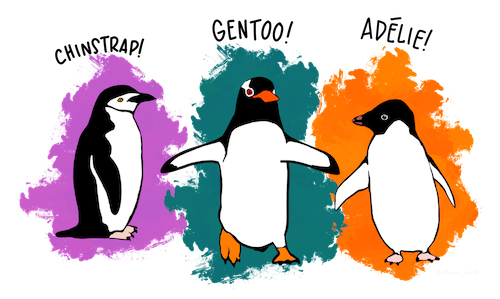
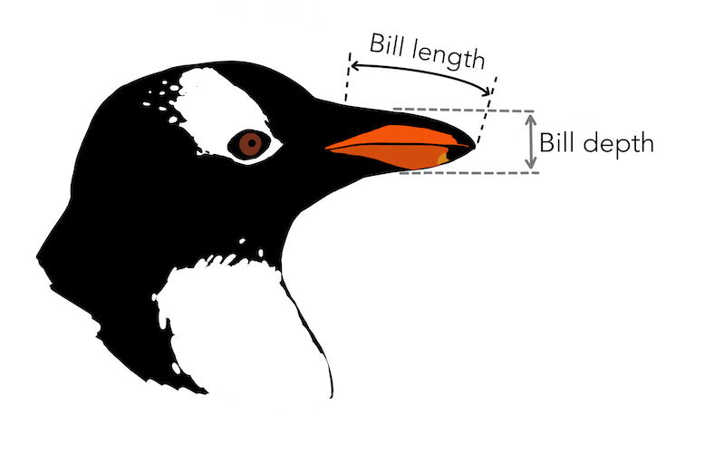
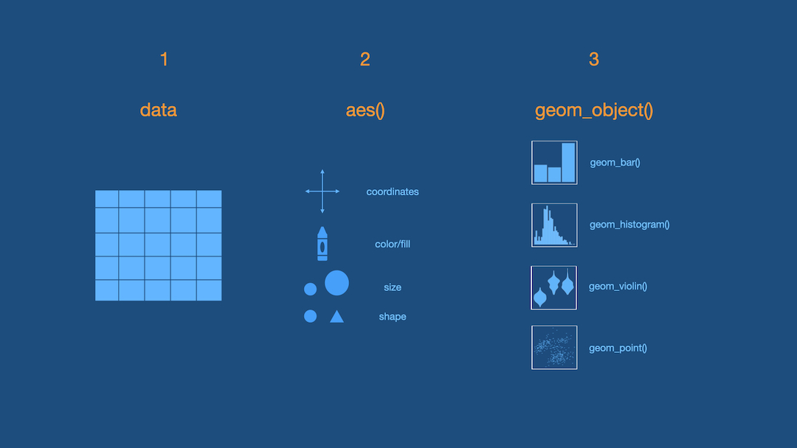

layout: true

<!-- This file by Mine Dogucu is licensed under a  Attribution-ShareAlike 2.5 Generic License (CC BY-SA 2.5) More information about the license can be found at https://creativecommons.org/licenses/by-sa/2.5/ -->
  
<div class="my-header"></div>

<div class="my-footer"> 
 CC BY-NC-ND 4.0 <a href="https://mdogucu.ics.uci.edu">Mine Dogucu</a></div> 

---

class: middle

```{r echo = FALSE, message=FALSE, warning=FALSE}
xaringanExtra::use_panelset()
library(openintro)
library(tidyverse)
library(palmerpenguins)
library(tidyverse)
library(titanic)
library(janitor)

babies <- babies %>% 
  mutate(smoke = as.logical(smoke),
         parity = as.logical(parity))
titanic <- titanic_train %>% 
  clean_names() %>% 
  select(survived, pclass, sex, age, fare, embarked) %>% 
  mutate(pclass = case_when(pclass == 1 ~ "First", 
                            pclass == 2 ~ "Second",
                            pclass == 3 ~ "Third"),
         embarked = case_when(embarked == "S" ~ "Southampton",
                              embarked == "C" ~ "Cherbourg",
                              embarked == "Q" ~ "Queenstown"),
         embarked = as.factor(embarked),
         sex = as.factor("sex"),
         survived = as.logical(survived))
```


[How LGBTQ+ hate crime is committed by young people against young people](https://www.bbc.com/news/uk-46543874)

[Why Time Flies](https://maximiliankiener.com/digitalprojects/time/)

[Mandatory Paid Vacation](https://www.instagram.com/p/CE1kpM5FhWR/?utm_source=ig_web_copy_link)

[Why are K-pop groups so big?](https://pudding.cool/2020/10/kpop/)

---

class: middle

Data Visualizations

- are graphical representations of data

--

- use different colors, shapes, and the coordinate system to summarize data

--

- tell a story

--

- are useful for exploring data


---

class: middle

First I go over different types of visualizations so that students can interpret what they see in the visuals.

The following is a useful resource for understanding histograms.


[Exploring Histograms Interactively](http://tinlizzie.org/histograms/)


---


class: middle

__gg__plot is based on __g__rammar of __g__raphics.

```{r echo = FALSE}

```

---

## Data

```{r}
glimpse(titanic)
```

.footnote[The data frame has been cleaned for you.]

---

class:inverse middle

.font75[Visualizing a Single Categorical Variable]

---

class: middle

.left-panel[
<br>
<br>
If you could speak to R in English, how would you tell R to make this plot for you?

OR

If you had the data and had to draw this bar plot by hand, what would you do?

]

.right-panel[

```{r echo=FALSE}
ggplot(titanic, aes(x = pclass)) +
  geom_bar()
```
]

---

class: middle

**3 Steps of Making a Basic ggplot**

1.Pick data

2.Map data onto aesthetics


3.Add the geometric layer


---
class: middle

### Step 1 - Pick Data

.pull-left[
```{r eval = FALSE}
ggplot(data = titanic)
```
]

.pull-right[

```{r echo = FALSE, fig.height=5}
ggplot(titanic)
```

]

---

class: middle

### Step 2 - Map Data to Aesthetics

.pull-left[
```{r eval = FALSE}
ggplot(data = titanic,
       aes(x = pclass)) #<<
```
]

.pull-right[

```{r echo = FALSE, fig.height=5}
ggplot(data = titanic,
       aes(x = pclass))
```

]

---

class: middle

### Step 3 - Add the Geometric Layer

.pull-left[
```{r eval = FALSE}
ggplot(data = titanic,
       aes(x = pclass)) +
  geom_bar() #<<
```
]

.pull-right[

```{r echo = FALSE, fig.height=5}
ggplot(data = titanic,
       aes(x = pclass)) +
  geom_bar()
```
]
---

class: middle 

.panelset[

.panel[
.panel-name[Plot]
```{r echo = FALSE, fig.height=5, fig.align='center'}
ggplot(data = titanic,
       aes(x = pclass)) +
  geom_bar()
```

]

.panel[
.panel-name[English]

- Create a ggplot using the `titanic` data frame.
- Map the `pclass` to the x-axis. 
- Add a layer of a bar plot.

]

.panel[
.panel-name[R]
```{r eval = FALSE, fig.height=5}
ggplot(data = titanic,
       aes(x = pclass)) +
  geom_bar()
```

]

]
---

class:inverse middle

.font75[Visualizing a Single Numeric Variable]

---

class: middle

.panelset[

.panel[
.panel-name[Plot]
```{r echo = FALSE, fig.height=5, fig.align='center'}
ggplot(data = titanic,
       aes(x = fare)) +
  geom_histogram() 
```

]

.panel[
.panel-name[English]

- Create a ggplot using the `titanic` data frame.
- Map the `fare` to the x-axis. 
- Add a layer of a histogram.

]

.panel[
.panel-name[R]
```{r eval = FALSE, fig.height=5}
ggplot(data = titanic,
       aes(x = fare)) +
  geom_histogram() 
```

]

]

---
class: middle

### Step 1 - Pick Data

.pull-left[
```{r eval = FALSE}
ggplot(data = titanic)
```
]

.pull-right[

```{r echo = FALSE, fig.height=5}
ggplot(titanic)
```

]

---

class: middle

### Step 2 - Map Data to Aesthetics

.pull-left[
```{r eval = FALSE}
ggplot(data = titanic,
       aes(x = fare)) #<<
```
]

.pull-right[

```{r echo = FALSE, fig.height=5}
ggplot(data = titanic,
       aes(x = fare))
```

]

---

class: middle

### Step 3 - Add the Geometric Layer

.pull-left[
```{r eval = FALSE}
ggplot(data = titanic,
       aes(x = fare)) +
  geom_histogram() #<<
```
]

.pull-right[

```{r echo = FALSE, fig.height=5}
ggplot(data = titanic,
       aes(x = fare)) +
  geom_histogram()
```
]

---

## What is this warning?

```{r echo = FALSE, fig.height=5, fig.align='center'}
ggplot(data = titanic,
       aes(x = fare)) +
  geom_histogram()
```

---


```{r fig.height=5, fig.align='center'}
ggplot(data = titanic,
       aes(x = fare)) +
  geom_histogram(binwidth = 15) #<<
```


---

class: middle


.panelset[
.panel[.panel-name[binwidth = 15]

.left-panel[


]

```{r echo = FALSE, fig.height=5, fig.align='center'}
ggplot(data = titanic,
       aes(x = fare)) +
  geom_histogram(binwidth = 15)
```

]

.panel[.panel-name[binwidth = 50]

```{r echo = FALSE, fig.height=5, fig.align='center'}
ggplot(data = titanic,
       aes(x = fare)) +
  geom_histogram(binwidth = 50)
```

]

.panel[.panel-name[binwidth = 100]

```{r echo = FALSE, fig.height=5, fig.align='center'}
ggplot(data = titanic,
       aes(x = fare)) +
  geom_histogram(binwidth = 100)
```

]


]


---

class: middle center


.font150[
`r emojifont::emoji(emojifont::search_emoji('rainbow'))[1]`
] 

Pick your favorite color(s) from the list at:

[bit.ly/colors-r](https://bit.ly/colors-r)

---

```{r fig.align='center', fig.height=5}
ggplot(data = titanic,
       aes(x = fare)) +
  geom_histogram(binwidth = 15, 
                 color = "white") #<<
```

---

```{r fig.align='center', fig.height=5}
ggplot(data = titanic,
       aes(x = fare)) +
  geom_histogram(binwidth = 15, 
                 fill = "darkred") #<<
```

---

```{r fig.align='center', fig.height=5}
ggplot(data = titanic,
       aes(x = fare)) +
  geom_histogram(binwidth = 15, 
                 color = "white", #<<
                 fill = "darkred") #<<
```

---

class: inverse middle center

.font75[Visualizing Two Categorical Variables]

---

## Stacked Bar-Plot

.pull-left[

```{r eval = FALSE}
ggplot(data = titanic,
       aes(x = pclass, 
           fill = survived)) + #<<
  geom_bar() 
```
]

.pull-right[

```{r echo = FALSE, fig.height=5}
ggplot(data = titanic,
       aes(x = pclass, 
           fill = survived)) +
  geom_bar()
```
]

---

## Standardized Bar Plot

.pull-left[

```{r eval = FALSE}
ggplot(data = titanic,
       aes(x = pclass, 
           fill = survived)) + 
  geom_bar(position = "fill") #<<
```
]

.pull-right[

```{r echo = FALSE, fig.height=5}
ggplot(data = titanic,
       aes(x = pclass, fill = survived)) +
  geom_bar(position = "fill")
```
]

.footnote[Note that y-axis is no longer count but we will learn how to change that later.]

---

## Dodged Bar Plot

.pull-left[

```{r eval = FALSE}
ggplot(data = titanic,
       aes(x = pclass, 
           fill = survived)) + 
  geom_bar(position = "dodge") #<<
```
]

.pull-right[

```{r echo = FALSE, fig.height=5}
ggplot(data = titanic,
       aes(x = pclass, fill = survived)) +
  geom_bar(position = "dodge")
```
]

.footnote[Note that y-axis is no longer count but we will change that later.]


---

## New Data

```{r echo = FALSE, fig.align='center', fig.height=0.3}

```

.footnote[Artwork by [@allison_horst](https://twitter.com/allison_horst) ]

---

## New Data

```{r}
glimpse(penguins)
```

---

```{r echo = FALSE, fig.align='center'}

```

.footnote[Artwork by [@allison_horst](https://twitter.com/allison_horst) ]


---

class: middle inverse

.font75[Visualizing a single numerical and single categorical variable.]

---

class: middle 

.panelset[

.panel[
.panel-name[Plot]
```{r echo = FALSE, fig.height=5, fig.align='center'}
ggplot(penguins,
       aes(x = species,
           y = bill_length_mm))  +
  geom_violin()
```

]

.panel[
.panel-name[English]

- Create a ggplot using the `penguins` data frame.
- Map the `species` to the x-axis and `bill_length_mm` to the y-axis. 
- Add a layer of a violin plot.

]

.panel[
.panel-name[R]
```{r eval = FALSE, fig.height=5}
ggplot(penguins,
       aes(x = species,
           y = bill_length_mm))  +
  geom_violin()
```

]

]

---


class: middle 

.panelset[

.panel[
.panel-name[Plot]
```{r echo = FALSE, fig.height=5, fig.align='center'}
ggplot(penguins,
       aes(x = species,
           y = bill_length_mm))  +
  geom_boxplot()
```

]

.panel[
.panel-name[English]

- Create a ggplot using the `penguins` data frame.
- Map the `species` to the x-axis and `bill_length_mm` to the y-axis. 
- Add a layer of a box plot.

]

.panel[
.panel-name[R]
```{r eval = FALSE, fig.height=5}
ggplot(penguins,
       aes(x = species,
           y = bill_length_mm))  +
  geom_boxplot()
```

]

]


---

class: middle

.pull-left[
```{r echo = FALSE, message = FALSE, warning = FALSE}
ggplot(penguins,
       aes(x = species,
           y = bill_length_mm))  +
  geom_violin() +
  theme(text = element_text(size=20))

```

]

.pull-right[
```{r echo = FALSE, message = FALSE, warning = FALSE}
ggplot(penguins,
       aes(x = bill_length_mm))  +
  geom_histogram() +
  facet_wrap(~species) +
  coord_flip() +
  theme(text = element_text(size=20))

```
]

.footnote[Note: Violin plots display densities, not counts!]

---
class: inverse middle

.font75[Visualizing Two Numerical Variables]

---

.left-panel[
```{r eval = FALSE}
ggplot(penguins,
       aes(x = bill_depth_mm,
           y = bill_length_mm))  +
  geom_point()
```

]

.right-panel[
```{r echo = FALSE}
ggplot(penguins,
       aes(x = bill_depth_mm,
           y = bill_length_mm))  +
  geom_point()
```

]

---
class: middle inverse

.font75[Considering More Than Two Variables]

---

.left-panel[
```{r eval = FALSE}
ggplot(penguins,
       aes(x = bill_depth_mm,
           y = bill_length_mm,
           color = species)) +
  geom_point()
```

]

.right-panel[
```{r echo = FALSE}
ggplot(penguins,
       aes(x = bill_depth_mm,
           y = bill_length_mm,
           color= species))  +
  geom_point()
```

]


---
.left-panel[
```{r eval = FALSE}
ggplot(penguins,
       aes(x = bill_depth_mm,
           y = bill_length_mm,
           shape = species)) +
  geom_point()
```

]

.right-panel[
```{r echo = FALSE}
ggplot(penguins,
       aes(x = bill_depth_mm,
           y = bill_length_mm,
           shape = species))  +
  geom_point()
```

]

---


.left-panel[
```{r eval = FALSE}
ggplot(penguins,
       aes(x = bill_depth_mm,
           y = bill_length_mm,
           shape = species)) +
  geom_point()
```

]

.right-panel[
```{r echo = FALSE}
ggplot(penguins,
       aes(x = bill_depth_mm,
           y = bill_length_mm,
           shape = species))  +
  geom_point()
```

]

---

.left-panel[
```{r eval = FALSE}
ggplot(penguins,
       aes(x = bill_depth_mm,
           y = bill_length_mm,
           shape = species,
           color = species)) +
  geom_point()
```

]

.right-panel[
```{r echo = FALSE}
ggplot(penguins,
       aes(x = bill_depth_mm,
           y = bill_length_mm,
           shape = species,
           color = species))  +
  geom_point()
```

]


---

.left-panel[
```{r eval = FALSE}
ggplot(penguins,
       aes(x = bill_depth_mm,
           y = bill_length_mm,
           shape = species,
           color = species,
           size = body_mass_g)) +
  geom_point()
```

]

.right-panel[
```{r echo = FALSE}
ggplot(penguins,
       aes(x = bill_depth_mm,
           y = bill_length_mm,
           shape = species,
           color = species,
           size = body_mass_g))  +
  geom_point()
```
]
---

```{r echo = FALSE, out.width ="95%"}

```


---

class: middle

## Practice

Using either the `babies`, `titanic` or `penguins` data frame ask a question that you are interested in answering. Visualize data to get a visual answer to the question. What is the visual telling you? Note all of this down in your lecture notes.

---


class: middle 
 

.panelset[
.panel[

.panel-name[Plot]

```{r echo = FALSE, fig.align='center', warning = FALSE, fig.height=5}
ggplot(penguins,
       aes(x = bill_depth_mm,
           y = bill_length_mm,
           shape = species,
           color = species)) +
  geom_point(size = 4) 
```

]

.panel[

.panel-name[English]
- Using the `penguins` data,   
- Map `bill depth` to x-axis, `bill length` to y-axis, `species` to shape and color.
- Add a layer of points and set the size of the points to 4.
]

.panel[
.panel-name[R]
```{r eval = FALSE}
ggplot(penguins,
       aes(x = bill_depth_mm,
           y = bill_length_mm,
           shape = species,
           color = species)) +
  geom_point(size = 4) 
```

]

]


---

class: middle 

## Labs


.panelset[
.panel[

.panel-name[Plot]

```{r echo = FALSE, fig.align='center', warning = FALSE, fig.height=5}
ggplot(penguins,
       aes(x = bill_depth_mm,
           y = bill_length_mm,
           shape = species,
           color = species)) +
  geom_point(size = 4) +
  labs(x = "Bill Depth (mm)", #<<
       y = "Bill Length (mm)", #<<
       title = "Palmer Penguins") #<<
```

]

.panel[

.panel-name[English]
- Using the `penguins` data,   
- Map `bill depth` to x-axis, `bill length` to y-axis, `species` to shape.
- Add a layer of points and set the size of the points to 4.
- .highlight-text[Add labels to x-axis (Bill Depth(mm)), y-axis (Bill Length(mm)), and the title of the plot (Palmer Penguins).]


.panel[
.panel-name[R]
```{r eval = FALSE}
ggplot(penguins,
       aes(x = bill_depth_mm,
           y = bill_length_mm,
           shape = species,
           color = species)) +
  geom_point(size = 4) +
  labs(x = "Bill Depth (mm)", #<<
       y = "Bill Length (mm)", #<<
       title = "Palmer Penguins") #<<
```

]

]


]

---

class: middle

.left-panel[
```{r eval = FALSE}
ggplot(penguins,
       aes(x = bill_depth_mm,
           y = bill_length_mm,
           shape = species,
           color = species)) +
  geom_point() +
  labs(x = "Bill Depth (mm)", 
       y = "Bill Length (mm)", 
       title = "Palmer Penguins") +
  theme_bw() #<<
  
```

]

.right-panel[
```{r echo = FALSE, fig.height=5, warning = FALSE}
ggplot(penguins,
       aes(x = bill_depth_mm,
           y = bill_length_mm,
           shape = species,
           color = species)) +
  geom_point() +
  labs(x = "Bill Depth (mm)",
       y = "Bill Length (mm)",
       title = "Palmer Penguins") +
  theme_bw()
```

]

---

class: middle

## Themes

.panelset[


.panel[

.panel-name[`theme_gray()`]

```{r echo = FALSE, fig.height=4, fig.align='center', warning = FALSE}
ggplot(penguins,
       aes(x = bill_depth_mm,
           y = bill_length_mm,
           shape = species,
           color = species)) +
  geom_point() +
  labs(x = "Bill Depth (mm)",
       y = "Bill Length (mm)",
       title = "Palmer Penguins") +
  theme_gray()
```

]

.panel[

.panel-name[`theme_bw()`]

```{r echo = FALSE, fig.height=4, fig.align='center', warning = FALSE}
ggplot(penguins,
       aes(x = bill_depth_mm,
           y = bill_length_mm,
           shape = species,
           color = species)) +
  geom_point() +
  labs(x = "Bill Depth (mm)",
       y = "Bill Length (mm)",
       title = "Palmer Penguins") +
  theme_bw()
```

]

.panel[

.panel-name[`theme_classic()`]

```{r echo = FALSE, fig.height=4, fig.align='center', warning = FALSE}
ggplot(penguins,
       aes(x = bill_depth_mm,
           y = bill_length_mm,
           shape = species,
           color = species)) +
  geom_point() +
  labs(x = "Bill Depth (mm)",
       y = "Bill Length (mm)",
       title = "Palmer Penguins") +
  theme_classic()
```

]

.panel[

.panel-name[`theme_dark()`]

```{r echo = FALSE, fig.height=4, fig.align='center', warning = FALSE}
ggplot(penguins,
       aes(x = bill_depth_mm,
           y = bill_length_mm,
           shape = species,
           color = species)) +
  geom_point() +
  labs(x = "Bill Depth (mm)",
       y = "Bill Length (mm)",
       title = "Palmer Penguins") +
  theme_dark()
```

]

.panel[
.panel-name[`theme_minimal()`]

```{r echo = FALSE, fig.height=4, fig.align='center', warning = FALSE}
ggplot(penguins,
       aes(x = bill_depth_mm,
           y = bill_length_mm,
           shape = species,
           color = species)) +
  geom_point() +
  labs(x = "Bill Depth (mm)",
       y = "Bill Length (mm)",
       title = "Palmer Penguins") +
  theme_minimal()
```

]


.panel[
.panel-name[`theme_void()`]

```{r echo = FALSE, fig.height=4, fig.align='center', warning = FALSE}
ggplot(penguins,
       aes(x = bill_depth_mm,
           y = bill_length_mm,
           shape = species,
           color = species)) +
  geom_point() +
  labs(x = "Bill Depth (mm)",
       y = "Bill Length (mm)",
       title = "Palmer Penguins") +
  theme_void()
```

]
]

---

class: middle 

.left-panel[

```{r eval = FALSE}
ggplot(penguins,
       aes(x = bill_depth_mm,
           y = bill_length_mm,
           shape = species,
           color = species)) +
  geom_point() +
  labs(x = "Bill Depth (mm)", 
       y = "Bill Length (mm)", 
       title = "Palmer Penguins") +
  theme_bw() +
  theme(text = element_text(size=20)) #<<
  
```

]

.right-panel[

```{r echo = FALSE, fig.height=5, warning = FALSE}
ggplot(penguins,
       aes(x = bill_depth_mm,
           y = bill_length_mm,
           shape = species,
           color = species)) +
  geom_point() +
  labs(x = "Bill Depth (mm)",
       y = "Bill Length (mm)",
       title = "Palmer Penguins") +
  theme_bw() +
  theme(text = element_text(size=20))
```
]


---

class: middle

```{r eval = FALSE}
?theme
```


---

class: middle 
 

.left-panel[

```{r eval = FALSE, fig.align='center', warning = FALSE, fig.height=5}
ggplot(penguins,
       aes(x = bill_depth_mm,
           y = bill_length_mm,
           shape = species,
           color = species)) +
  geom_point(size = 4) +
  facet_grid(.~species) #<<
```

]

.right-panel[
```{r echo = FALSE, fig.align='center', warning = FALSE, fig.height=5}
ggplot(penguins,
       aes(x = bill_depth_mm,
           y = bill_length_mm,
           shape = species,
           color = species)) +
  geom_point(size = 4) +
  facet_grid(.~species)
```
]

---

class: middle 
 

.left-panel[

```{r eval = FALSE, fig.align='center', warning = FALSE, fig.height=5}
ggplot(penguins,
       aes(x = bill_depth_mm,
           y = bill_length_mm,
           shape = species,
           color = species)) +
  geom_point(size = 4) +
  facet_grid(species~.) #<<
```

]

.right-panel[
```{r echo = FALSE, fig.align='center', warning = FALSE, fig.height=5}
ggplot(penguins,
       aes(x = bill_depth_mm,
           y = bill_length_mm,
           shape = species,
           color = species)) +
  geom_point(size = 4) +
  facet_grid(species~.)
```
]

---

class: middle

.left-panel[
```{r eval = FALSE}
ggplot(penguins,
       aes(x = bill_depth_mm,
           y = bill_length_mm)) +
  geom_point() +
  xlim(0, 30) + #<<
  ylim(0,70) #<<
  
```

]

.right-panel[
```{r echo = FALSE, fig.height=5, warning = FALSE}
ggplot(penguins,
       aes(x = bill_depth_mm,
           y = bill_length_mm)) +
  geom_point() +
  xlim(0, 30) +
  ylim(0,70)
```

]


---

class: middle

## code style

[The tidyverse style guide](https://style.tidyverse.org/ggplot2.html) has the following convention for writing ggplot2 code.

The plus sign for adding layers `+` always has a space before it and is followed by a new line. 

The new line is indented by two spaces. RStudio does this automatically for you. 

---
class: middle

[Top Ten Dos and Don't for Charts and Graphs](https://guides.lib.uci.edu/datavis/do)

---

class: middle

Check out [the ggplot flipbook](https://evamaerey.github.io/ggplot_flipbook/ggplot_flipbook_xaringan.html#1) for some inspiration. 
Find your favorite new function/feature. 
Share it with your neighbor.


---

class: middle 

## ggplot extensions

- [`patchwork`](https://patchwork.data-imaginist.com/) combining plots into a single plot
- [`gganimate`](https://gganimate.com/) animated graphics
- [`ggthemes`](https://rafalab.github.io/dsbook/ggplot2.html#add-on-packages) additional set of themes
- [`ggtext`](https://wilkelab.org/ggtext/) improved text rendering support for ggplot2

There are [more extensions](https://exts.ggplot2.tidyverse.org/gallery/)


---

class: middle 

## Detour: R Markdown chunk options

`r ''````{r, echo=TRUE, message=FALSE}
```
---


class: center middle 

## (some) Chunk Options in R Markdown

<table align = "center">

<tr>

<td>echo = FALSE</td>
<td>hides the code</td>

</tr>

<tr>

<td>message = FALSE</td>
<td>hides messages</td>

</tr>

<tr>

<td>warning = FALSE</td>
<td>hides warning</td>

</tr>

<tr>

<td>error = TRUE</td>
<td>renders despite errors and displays the error</td>

</tr>

<tr>

<td>fig.cap = "Some figure caption"</td>
<td>creates a figure caption</td>

</tr>

<tr>

<td>fig.alt = "Some alternate text for figure"</td>
<td>creates alternate text for figures</td>

</tr>


</table>


---

class: middle


## Schedule for the Day

__10:00 - 10:15 Introduction and Setup__  
__10:15 - 11:15 Introduction to Toolkit and Data Basics__  
__11:20 - 12:30 Data Visualization__  
1:00 - 1:45 Data Wrangling   
1:45 - 2:15 Packages and External Datasets
2:15 - 2:30 Wrap Up 