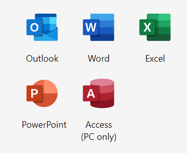
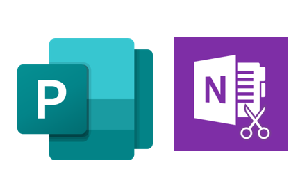
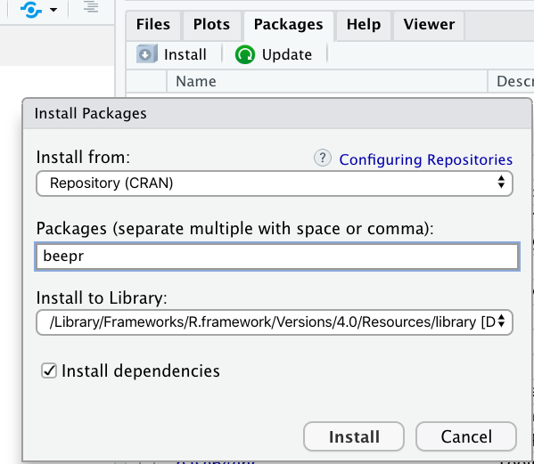
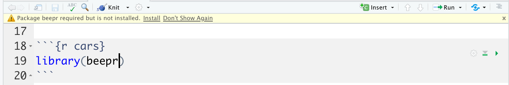
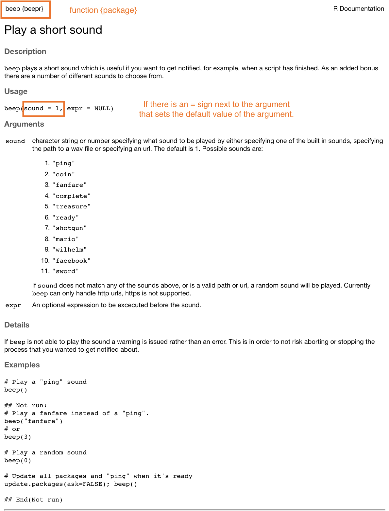

layout: true

<!-- This file by Mine Dogucu is licensed under a  Attribution-ShareAlike 2.5 Generic License (CC BY-SA 2.5) More information about the license can be found at https://creativecommons.org/licenses/by-sa/2.5/ -->
  
<div class="my-header"></div>

<div class="my-footer"> 
 CC BY-NC-ND 4.0 <a href="https://mdogucu.ics.uci.edu">Mine Dogucu</a></div> 

---

```{r echo = FALSE, message = FALSE}
library(tidyverse)
options(scipen = 999)
```


class: middle

## Goals

- R packages
- Importing Data
- Projects Workflow

---

class: center middle inverse

.font50[Naming files]

---
class: middle center

.pull-left[

__Default__

```{r echo=FALSE, out.width='60%'}

```

]

.footnote[Microsoft products have Copyright. Images used based on [fair use](https://www.microsoft.com/en-us/legal/copyright/default.aspx) for educational purposes.]

.pull-right[

__Optional__

```{r echo=FALSE, out.width='60%'}

```


]

---
class: middle

## R packages


When you download R, you actually download base R. 

--

But there are MANY optional packages you can download.


---

class: middle


## R packages

There are more than 15000 R packages. 

--

Good part: There is an R package for (almost) everything, from complex statistical modeling packages to baby names.

--

Bad part: At the beginning it can feel overwhelming. 

---

class: middle 

## R packages

All this time we have actually been using R packages. 

---

class: middle 

## R packages

What do R packages have? All sorts of things but mainly

- functions 

- datasets

---

class: middle

## R packages

Try running the following code:

```{r error = TRUE}
beep()
```

Why are we seeing this error? 

---

class:inverse middle

.font75[Installing packages]

---

## Using `install.packages()`

In your **Console**, install the beepr package

```{r eval = FALSE}
install.packages("beepr")
```

We do this in the Console because we only need to do it once.

---

## Using Packages pane

```{r echo = FALSE, out.width="40%", fig.align='center'}

```

Packages Pane > Install 

---

## Letting RStudio Install

```{r echo = FALSE, out.width="80%", fig.align='center'}

```

If you save your file and using a package RStudio will tell you that you have not installed the package.

---

class:inverse middle

.font75[Using packages]

---

## Using beep() from beepr

.pull-left[
Option 1
```{r warning = FALSE, eval = FALSE}
library(beepr)
beep()
```

More common usage. 
Useful if you are going to use multiple functions from the same package.
E.g. we have used many functions (ggplot, aes, geom_...) from the ggplot2 package. In such cases, usual practice is to put the library name in the first R chunk in the .Rmd file.

]

.pull-right[
Option 2
```{r eval = FALSE}
beepr::beep()
```
Useful when you are going to use a function once or few times. Also useful if there are any conflicts. For instance if there is some other package in your environment that has a beep() function that prints the word beep, you would want to distinguish the beep function from the beepr package and the beep function from the other imaginary package. 
]

---

```{r echo=FALSE, fig.align='center', out.width="80%"}

```


---

class: middle

## Open Source

Any one around the world can create R packages. 

--

Good part: We are able to do pretty much anything R because someone from around the world has developed the package and shared it. 

--

Bad part: The language can be inconsistent. 

--

Good news: We have tidyverse. 


---

## Tidyverse


>The tidyverse is an opinionated collection of R packages designed for data science. All packages share an underlying design philosophy, grammar, and data structures. 
                  tidyverse.org
---

## Tidyverse

In short, tidyverse is a family of packages. From practical stand point, you can install many tidyverse packages at once (and you did this). By doing that you installed all the following packages.

- ggplot2
- dplyr
- tidyr
- readr
- purrr
- tibble
- stringr
- forcats

---

class: middle 

We can also load the tidyverse packages all at the same time.

```{r message = TRUE}
library(tidyverse)
```

---

## Fun fact

.left-panel[
```{r message = FALSE}
library(magrittr)
```

```{r echo=FALSE, out.width='40%', fig.align='center'}
knitr::include_graphics('img/pipe-logo.png')
```
]

.right-panel[
[Treachery of Images](https://en.wikipedia.org/wiki/The_Treachery_of_Images#/media/File:MagrittePipe.jpg) by René Magritte

```{r echo=FALSE, out.width='70%', fig.align='center'}
knitr::include_graphics('img/magritte.jpg')
```

.footnote[Image for Treachery of Images is from University of Alabama [website](https://tcf.ua.edu/Classes/Jbutler/T311/Modernism.htm) and used under fair use for educational purposes.]
]


---


class: center middle inverse

.font50[Naming files]

---

class: middle

Three principles of naming files 

- machine readable
- human readable
- plays well with default ordering (e.g. alphabetical and numerical ordering)

(Jenny Bryan)

for the purposes of this class an additional principle is that file names follow

- tidyverse style (all lower case letters, words separated by HYPHEN)

---

class: center middle inverse

.font50[README.md]

---

class: middle

- README file is the first file users read. In our case a user might be our future self, a teammate, or (if open source) anyone.

--

- There can be multiple README files within a single directory: e.g. for the general project folder and then for a data subfolder. Data folder README's can possibly contain codebook (data dictionary).

--

- It should be brief but detailed enough to help user navigate. 

--

- a README should be up-to-date (e.g. from proposal to presentation stage of final projects they need to be updated).

--

- On GitHub we use markdown for README file (`README.md`). Good news: [emojis are supported.](https://gist.github.com/rxaviers/7360908)

---

class: middle

## README examples

- [ICS 80 website](https://github.com/ics80-fa21/website)
- [Museum of Modern Art Collection](https://github.com/MuseumofModernArt/collection)
- [R package bayesrules](https://github.com/bayes-rules/bayesrules)

---

class: center middle inverse

.font50[Importing data]

---

class: middle

## Importing .csv Data 


```{r eval = FALSE}
readr::read_csv("dataset.csv")
```

---

class: middle

## Importing Excel Data

```{r eval = FALSE}
readxl::read_excel("dataset.xlsx")
```

 

---

class: middle


## Importing Excel Data

```{r eval = FALSE}
readxl::read_excel("dataset.xlsx", sheet = 2)
```

---

class: middle

## Importing SAS, SPSS, Stata Data

```{r eval = FALSE}
library(haven)
# SAS
read_sas("dataset.sas7bdat")
# SPSS
read_sav("dataset.sav")
# Stata
read_dta("dataset.dta")
```


---

## Where is the dataset file?

Importing data will depend on where the dataset is on your computer. However we use the help of `here::here()` function. 
This function sets the working directory to the project folder (i.e. where the `.Rproj` file is).

```{r eval = FALSE}
read_csv(here::here("data/dataset.csv"))
```


---

class: middle


## Schedule for the Day

__10:00 - 10:15 Introduction and Setup__  
10:15 - 11:15 Introduction to Toolkit and Data Basics
11:20 - 12:30 Data Visualization  
1:00 - 1:45 Data Wrangling   
1:45 - 2:15 Packages and External Datasets
__2:15 - 2:30 Wrap Up__